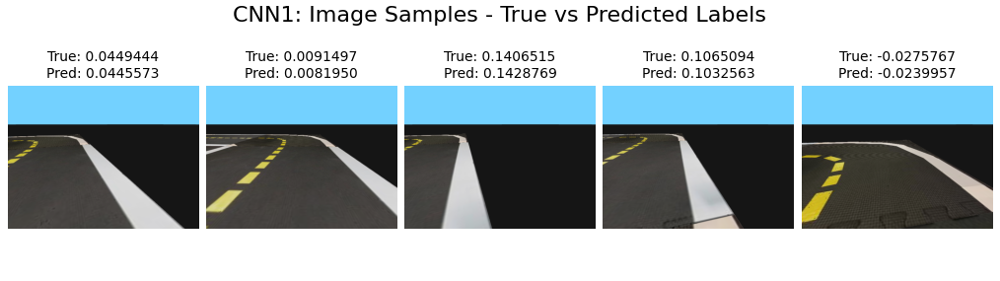
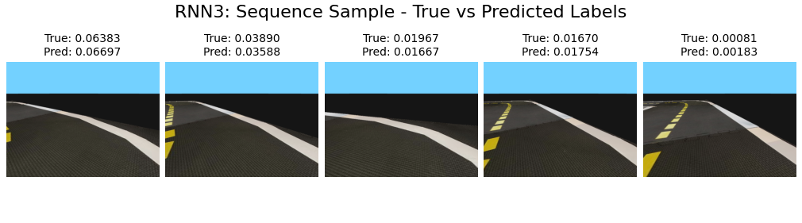

# PIDPlus Training
Training of our model for IFT6757 "Duckietown" class project PIDPlus. While this page will help you run the training of our models, this will also allow you to run the gym-duckietown simulator and our script to generate the dataset we used in training.


## Datasets and weights
Here are our datasets we created and some weights for each of our models : 

Dataset : [here](https://1drv.ms/u/s!AmxJyID0MPIzlZ1VALdvhZNA4hsX6A?e=6yPjfp)
Weights : [here](https://1drv.ms/u/s!AmxJyID0MPIzlZ1Wola6EJrP-KDuyA?e=0DKmbD)
## How to use it

### 1 Basic requirements
For this project, you will need these requirements
- Linux File System 
- Docker 
- Duckietown Shell
- Conda (Or miniconda)
  - For installing miniconda on linux, you can use these commands
    ```
    curl -O https://repo.anaconda.com/miniconda/Miniconda3-latest-Linux-x86_64.sh
    bash ~/Miniconda3-latest-Linux-x86_64.sh
    ```
    Do the install steps, select a default install location and initialization options. After that, you can re-open a terminal window or use this command to refresh the current terminal.
    ```
    source ~/.bashrc
    ```
### 2. Create Virtual Environment
You will then create your virtual environment with conda for being able to run everything. This will install most of the dependencies and is necessary to run Gym-Duckietown in general. Run this command at the root of this repository. This might take a while.
```
conda env create -f environment.yaml
```

You can then simply activate your newly created environment using 
```
conda activate gym-duckietown
```

### 3. Install extra dependencies
There are some extra dependencies needed for running everything. You will first need to do 
```
pip install -e .
```
After that there is some versions that need to be specified, so simply run this command : 
``` 
pip install numpy==1.22 pyglet==1.5.15 Pillow torchsummary tqdm
```
Finally, we use conda to install the last of the dependencies, running
```
conda install -c conda-forge libstdcxx-ng
```
It is expected too see some conflicting version of dependencies while running these. But after running these commands you should be set to train a model with our notebooks !

### 4. Importing dataset
Before training a model, you will need a dataset ! We've made the one we created available [here](https://1drv.ms/u/s!AmxJyID0MPIzlZ1PKpnpfFRp1i37Pw?e=6nEsEP). Simply download it and chose between which datasets you want (1,2 or 3). The second and third are for the RNN aswell but still work without any trouble for the CNN. Place then the images, labels and actions in the `learning/dataset` folder, each having their subfolders `actions`, `images` and `labels`. If they are not there, simply create them.

### 5. Import weights
If you want to import weigths, make sure to download this [folder](https://1drv.ms/u/s!AmxJyID0MPIzlZ1Wola6EJrP-KDuyA?e=0DKmbD) and place the `.pth` in either `learning/CNN` for the CNN models or `learning/RNN` for the RNN models.

### 6. Run the training
After installing the necessary dependencies, and importing the dataset, you can simply run the training by going into the `learning/CNN` or `learning/RNN` folder and running

```
python MODEL_NAME.py
```
MODEL_NAME here is either `CNN1`, `CNN2`, `RNN1`, `RNN2`, `RNN3`, `RNN4` which are all of our different model we tested.
